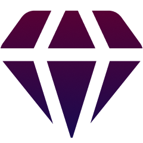

# 🌙 NightOut

<div align="center">
  
  
  [](https://github.com/Rediaj04/NightOut/blob/main/LICENSE)
  [](https://vuejs.org/)
  [](https://ionicframework.com/)
</div>

## 📱 Descripción

NightOut es una aplicación móvil innovadora diseñada para ayudarte a descubrir y reservar las mejores discotecas y clubes nocturnos cerca de ti. Con una interfaz intuitiva y moderna, NightOut te permite explorar venues, ver eventos en tiempo real, y gestionar tus reservas de manera sencilla.

## ✨ Características Principales

- 🗺️ **Mapa Interactivo**: Visualiza todos los clubes cercanos a tu ubicación
- 🎫 **Sistema de Reservas**: Proceso de reserva simplificado en tres pasos
- 💳 **Pagos Seguros**: Integración de pagos segura y confiable
- 📍 **Geolocalización**: Encuentra los mejores lugares cerca de ti
- 🌟 **Reseñas y Calificaciones**: Sistema de valoración de usuarios
- 📱 **Diseño Responsive**: Experiencia optimizada para cualquier dispositivo

## 🛠️ Tecnologías Utilizadas

- **Frontend**: Vue.js 3 + TypeScript
- **Framework Mobile**: Ionic 7
- **Estado Global**: Pinia
- **Mapas**: Leaflet
- **Estilos**: CSS personalizado con variables Ionic
- **Routing**: Vue Router

## 🚀 Instalación

1. Clona el repositorio:
```bash
git clone https://github.com/Rediaj04/NightOut.git
```

2. Instala las dependencias:
```bash
cd NightOut
npm install
```

3. Inicia el servidor de desarrollo:
```bash
npm run dev
```

## 📱 Capturas de Pantalla

<div align="center">
  
  
  
</div>

## 🗺️ Estructura del Proyecto

```
NightOut/
├── src/
│   ├── assets/          # Recursos estáticos
│   ├── components/      # Componentes reutilizables
│   ├── views/          # Vistas principales
│   ├── router/         # Configuración de rutas
│   ├── stores/         # Estado global con Pinia
│   └── theme/          # Estilos globales
├── public/             # Archivos públicos
└── ...
```

## 🤝 Contribuir

Las contribuciones son siempre bienvenidas. 

1. Fork el proyecto
2. Crea tu rama de características (`git checkout -b feature/AmazingFeature`)
3. Commit tus cambios (`git commit -m 'Add some AmazingFeature'`)
4. Push a la rama (`git push origin feature/AmazingFeature`)
5. Abre un Pull Request

## 📄 Licencia

Este proyecto está bajo la Licencia MIT - ver el archivo [LICENSE](LICENSE) para más detalles.

## 👤 Autor

**Rediaj04**

* GitHub: [@Rediaj04](https://github.com/Rediaj04)

## 🌟 Agradecimientos

- A todos los contribuidores que han participado en este proyecto
- A la comunidad de Vue.js e Ionic por su excelente documentación
- A todos los usuarios que confían en NightOut para sus salidas nocturnas

---
<div align="center">
  Hecho con ❤️ por <a href="https://github.com/Rediaj04">Rediaj04</a>
</div>
